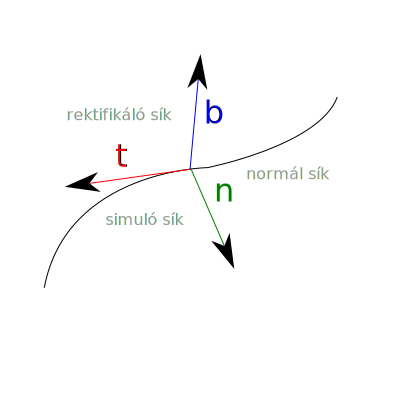

******
Görbék
******

Típusok
=======

A görbéket különféle szempontok alapján osztályozhatjuk.

* Az alapján, hogy hány dimenziós az a tér, amelyben értelmezzük. A dimenziószám jellemzően egy 1-nél nagyobb egész szám. Dimenziószám alapján általában egyszerűen sík görbékről és tér görbékről beszélünk.
* A görbe hossza alapján beszélhetünk véges vagy végtelen hosszú görbéről.
* Véges hosszúságú görbék esetében megkülönböztethetünk nyitott és zárt görbéket.
* A differenciálhatóság és periodicitás szintén lehetőséget ad az osztályozásukra.
* Szempontként tekinthetjük, hogy a görbe metszi-e önmagát vagy sem.

.. note::

  A fraktál görbék és térkitöltő görbék külön, érdekes témakörök, melyek kapcsán az előző általánosításokat óvatosan kell kezelni.

Leírási módok
=============

Síkgörbék esetében alapvetően a következő leírási módok állnak rendelkezésre:

* Explicit: :math:`y = f(x)`,
* Implicit: :math:`F(x, y) = 0`,
* Paraméteres: :math:`[x(t), y(t)]`,

ahol :math:`x, y, t \in \mathbb{R}`.

Térgörbék esetében az explicit leírási mód nem használható, így maradnak az alábbiak:

* Implicit: :math:`F(x, y, z) = 0`,
* Paraméteres: :math:`[x(t), y(t), z(t)]`,

ahol :math:`x, y, z, t \in \mathbb{R}`.

.. admonition:: Példa

  .. :collapsible: closed

  Írjuk fel az egyenest, mint görbét síkban és térben!

  Síkgörbe esetén

  * Általánosan használhatjuk például az :math:`y = m \cdot x + b` alakot, ahol :math:`m, b \in \mathbb{R}`.
  * Implicit formában az :math:`F(x, y) = m \cdot x + b - y` alakot írhatjuk föl.
  * Paraméteres formában ismernünk kell a görbe egy :math:`(x_0, y_0)` pontját, és az egyenes irányvektorát :math:`(\Delta x, \Delta y)`, amelyből :math:`[x_0 + \Delta x \cdot t, y_0 + \Delta y \cdot t]` formában előállnak az egyenes pontjai.

  Térgörbéknél

  * Az :math:`x` tengelyre illeszkedő egyenes felírható implicit formában például, mint :math:`F(x, y, z) = y^2 + z^2`. (A négyzetreemelés helyett bármilyen függvény megfelelő lehet, amely azt garantálja, hogy csak az :math:`y = z = 0` esetben legyen az :math:`F(x, y, z)` függvény értéke 0, tehát az :math:`F(x, y, z) = |y| + |z|` is megfelelő.) A tér elforgatásával és eltolásával így tetszőleges egyenes felírható.
  * Paraméteres formában ismernünk kell a görbe egy :math:`(x_0, y_0, z_0)` pontját, és az egyenes irányvektorát :math:`(\Delta x, \Delta y, \Delta z)`, amelyből :math:`[x_0 + \Delta x \cdot t, y_0 + \Delta y \cdot t, z_0 + \Delta z \cdot t]` formában előállnak az egyenes pontjai.

  .. seealso::

    * https://krammer.web.elte.hu/infokar/grafika/jegyzet/Jegyzetlapok/G22-Egyenesek-es-sikok.html
    * https://bivan.web.elte.hu/wiki/download/3-tetel-javitott.pdf

A leírási módokkal kapcsolatos észrevételek:

* Az explicit alakról egyszerűen át lehet térni az implicitre az :math:`F(x, y) = f(x) - y` összefüggést felhasználva.
* Az implicit alakkal egyszerűen ellenőrízhető, hogy a tér egy tetszőleges pontja a görbéhez tartozik-e, a görbe pontjainak a bejárása viszont körülményes lehet.
* A paraméteres alak általánosan jól használható tetszőleges dimenziós térben.
* A paraméteres alak mindenképpen egy görbét ad meg (amely előfordulhat, hogy metszi magát). Az implicit alak esetében nem feltétlenül görbét kapunk, mivel az síkban alkalmas zárt síkidomok, térben pedig felszínek leírására is.

Differenciálgeometriai definíció
--------------------------------

Az :math:`\textbf{r}(t) = [x_1(t), \ldots, x_n(t)], t \in [a, b]` ponthalmazt görbének nevezzük, hogy ha az :math:`\textbf{r}` függvény

* kölcsönösen egyértelmű, mindkét irányban folytonos,
* :math:`t` szerint folytonosan differenciálható,
* :math:`\dot{\textbf{r}} \neq 0, \forall t \in [a, b]`.

Paraméteres görbék
==================

Tetszőleges dimenziós tér esetében lehetőségünk van egy :math:`\mathbb{R} \rightarrow \mathbb{R}^n` (folytonos) függvény felírására, amely így egy görbe pontjait fogja tudni leírni. Ennek paraméterét :math:`t`-vel vagy :math:`u`-val szokták jelölni. (A :math:`t` az idő paraméterre utal, hogy ha a szemléletesen a görbe pontjainak bejárásáról van szó valamilyen sebességgel.)

* A paraméter tartománya lehet véges vagy végtelen.
* Egyazon görbének többféle paraméteres leírása is lehet.

Ívhossz
-------

A görbék egyik legtermészetesebb módon adódó jellemzőjük a hosszuk. Ezt ívhossznak nevezzük. Egy :math:`\textbf{r}(t), t \in [a, b]` görbe :math:`a` és :math:`t` paraméterei közé eső ívének hossza az

.. math::

  s(t) = \int_{a}^{t} \! \lVert \dot{\textbf{r}}(t)\rVert \, \mathrm{d}t

formában számítható ki.

Ennek belátásához osszuk a :math:`[a, b]` intervallumot :math:`n` részre egyenközű felosztással. Legyen

.. math::

  \Delta t = \dfrac{b - a}{n},

melyből az :math:`i`-edik osztópont paramétere :math:`t_i = a + i \Delta t` lesz. A görbe :math:`t_i` paraméterhez tartozó pontjából a :math:`t_{i+1}`-be mutató vektorát ekkor a

.. math::

  \Delta \textbf{r}_i = \textbf{r}(t_{i+1}) - \textbf{r}(t_i)

formában számolhatjuk, ahol :math:`i = 0, 1, 2, \ldots, n`. Az így kapott vektor hosszát :math:`\lVert\Delta \textbf{r}_i\rVert` jelöléssel adjuk meg. Az :math:`n` részre osztással kapott törötvonalas közelítés hossza tehát

.. math::

  s_n = \sum_{i=0}^{n-1} \lVert\Delta \textbf{r}_i\rVert =
        \sum_{i=0}^{n-1} \left\lVert \dfrac{\Delta \textbf{r}_i}{\Delta t} \right\rVert \Delta t.

Az :math:`n` értékét növelve a közelítő töröttvonal közelíteni fogja az ívhosszat, vagyis

.. math::

  \lim_{n\rightarrow\infty} s_n = s,

amelyből adódik, hogy

.. math::

  s(t) = \int_{a}^{t} \! \lVert \dot{\textbf{r}}(t)\rVert \, \mathrm{d}t.

.. admonition:: Példa

    Számítsuk ki a :math:`y = \sin^2(x) + \cos(x)` egyenlettel explicit formában megadott görbének az :math:`x \in [1, 4]` intervallum feletti ívének a hosszát!

    Először írjuk fel a görbe paraméteres alakját!

    Ez a következő formában adódik:

    .. math::

        \textbf{r}(t) = \begin{bmatrix}
            t \\
            \sin^2(t) + \cos(t)
        \end{bmatrix}.

    A görbe :math:`t` szerinti deriváltja:

    .. math::

        \dot{\textbf{r}}(t) = \begin{bmatrix}
        1 \\
        2 \cdot \sin(t) \cdot \cos(t) - \sin(t)
        \end{bmatrix}.

    Az ívhossz számításához az integrandusba fel kell írni az euklideszi normát (euklideszi teret feltételezve):

    .. math::

        s(t) =
        \int_{1}^{4} \! \lVert \dot{\textbf{r}}(t)\rVert \, \mathrm{d}t =
        \int_{1}^{4} \! \sqrt{1 + (2 \cdot \sin(t) \cdot \cos(t) - \sin(t))^2} \, \mathrm{d}t.

    Az integrál becslését numerikus közelítéssel végezhetjük, például az alábbi JavaScript kód segítségével.

    .. code:: javascript

        function calc_integrand(t) {
            let s = Math.sin(t);
            let c = Math.cos(t);
            return Math.sqrt(1 + Math.pow(2 * s * c - s, 2));
        }

        const N = 100000;
        let s = 0.0;
        for (let i = 0; i < N; i++) {
            t = (i / N) * 3 + 1;
            s += calc_integrand(t);
        }
        s *= (3.0 / N);
        console.log(s);

    A program kimenete alapján az ívhossz 4.55 körüli érték.

    .. plot sin^2 x + cos x from 1 to 4
    .. int from 1 to 4 sqrt(1 + (2 sin(x) cos(x) - sin(x))^2) dx
    .. 4.55006291588

Kísérő triéder
--------------

Térgörbék esetében beszélhetünk kísérő triéderről. Ez egy speciális koordinátarendszer, amely a görbe egy pontjához tartozik. Minden pontjához meg tudunk adni egyet, feltételezve, hogy

* a görbe kétszer folytonosan differenciálható, és
* :math:`\ddot{\textbf{r}}(u) \neq \textbf{0}, \forall u \in [a, b]`.

A kísérőtriéder egy vektorhármas, melynek vektorai

* az érintővektor: :math:`\textbf{t}(u) = \dfrac{\dot{\textbf{r}}(u)}{\lVert\dot{\textbf{r}}(u)\rVert}`,
* a binormális: :math:`\textbf{b}(u) = \dfrac{\dot{\textbf{r}}(u) \times \ddot{\textbf{r}}(u)}{\lVert\dot{\textbf{r}}(u) \times \ddot{\textbf{r}}(u)\rVert}` és
* a főnormális: :math:`\textbf{n}(u) = \textbf{b}(u) \times \textbf{t}(u)`,

amelyek egy jobbsodrású Descartes-féle derékszögű koordinátarendszert alkotnak.

A kísérőtriéder vektorai páronként egy-egy síkot határoznak meg, melyeknek külön neve van:

* :math:`(\textbf{b}(u), \textbf{n}(u))`: normál sík,
* :math:`(\textbf{t}(u), \textbf{n}(u))`: simuló sík, és
* :math:`(\textbf{t}(u), \textbf{b}(u))`: rektifikáló sík.

.. seealso::

  * https://hu.wikipedia.org/wiki/T%C3%A9rg%C3%B6rbe

Érintőegyenes
-------------

Az érintőegyenes a görbe pontjaihoz tartozik. Tekintsük ezt egy rögzített, :math:`t_0` paraméterértékhez tartozó :math:`\textbf{r}(t_0)` pontnak!

* Az adott pont mindenképpen pontja a görbének és az egyenesnek is. (Lehet több közös pontjuk is.)
* Az egyenes iránya megegyezik az érintővektor irányával.
* Az érintőegyenes független az adott pontbeli érintővektor hosszától, így az egyenes felírására adódik egy :math:`\lambda \in \mathbb{R}, \lambda \neq 0` szabad paraméterünk.

Az érintőegyenes paraméteres alakja így:

.. math::

  \textbf{e}(t) = \textbf{r}(t_0) + t \cdot \lambda \cdot \dot{\textbf{r}}(t_0),

ahol :math:`\textbf{e}: \mathbb{R} \rightarrow \mathbb{R}^n`.

Görbület, simulókör
-------------------

Az egymást követő pontokban (az egyenest, mint speciális esetet leszámítva) az érintővektorok iránya változik. Az irány változásnak a sebességét, más szóval a görbe egyenestől való eltérését a görbülettel (mint mérőszámmal) jellemezhetjük.

Vizsgáljunk egy görbét a természetes (ívhossz szerinti) paraméterezésével felírva, mint :math:`\textbf{r}(s)`.

.. note::

  Az ívhossz szerinti paraméterezés azért lényeges, hogy a görbét a paraméterezési mód megválasztásától függetlenül, az azon való végighaladás sebességének függvényében tudjuk jellemezni.

Válasszunk a görbén egy :math:`s` és egy :math:`s_0` paramétert. Jelöljük :math:`\Delta \alpha`-val a két ponthoz tartozó érintő bezárt szögét, továbbá legyen :math:`\Delta s = |s - s_0|`! Az :math:`s_0` pontbeli görbületet az alábbi formában definiáljuk:

.. math::

  \kappa (s_0) = \lim_{s \rightarrow s_0} \dfrac{\Delta \alpha}{\Delta s}.

Ívhossz szerinti paraméterezés esetén a pontbeli határérték felírható a következő alakban:

.. math::

  \kappa (s) = \lVert \textbf{r}''(s) \rVert.

Általános :math:`t` szerinti paraméterezés esetén:

.. math::

  \kappa (t) = \dfrac
  {\lVert \dot{\textbf{r}}(t) \times \ddot{\textbf{r}}(t) \rVert}
  {\lVert \dot{\textbf{r}}(t) \rVert^3}.

A görbület néhány tulajdonsága:

* A görbület invariáns a görbe egybevágósági transzformációjára.
* Az egyenes görbülete azonosan nulla.
* A görbék közül csak az egyenesnek és a körnek konstans a görbülete.
* Síkgörbék esetében a görbülethez előjelet is rendelhetünk. Ahol a görbület előjelet vált, ott lesz a görbének az inflexiós pontja.

.. seealso::

  * https://hu.wikipedia.org/wiki/G%C3%B6rb%C3%BClet
  * https://en.wikipedia.org/wiki/Curvature

A görbe :math:`t` pontjához tartozó simulókör az a kör, amelynek

* síkja a :math:`t` ponthoz tartozó simuló sík,
* sugara :math:`\rho (t) = \dfrac{1}{\kappa (t)}`,
* középpontja :math:`\textbf{c}(t) = \textbf{r}(t) + \rho(t)\textbf{n}(t)`.

Abban az esetben beszélhetünk róla, hogy ha a görbület nem nulla. (Hogy ha 0 lenne, akkor egy végtelen sugaró körnek tekinthetnénk.)

Torzió
------

hogy ha térben vizsgálunk síkgörbéket, akkor azok binormálisai párhuzamosak lesznek, vagy mondhatjuk úgy is, hogy simulósíkjaik egybeesnek. Akkor tekinthetünk ténylegesen térgörbének egy görbét, hogy ha ez nem teljesül rá, vagyis a binormálisok iránya pontonként változik.

A görbék síkgörbétől való eltérését a torzióval (mint mérőszámmal) jellemezhetjük.

Tegyük fel, hogy adott egy :math:`\textbf{r}(s)` görbe ívhossz szerinti paraméterezéssel. Vizsgáljuk a görbét az :math:`s` és :math:`s_0` paramétereknél! Legyen :math:`\Delta \beta` a :math:`\textbf{b}(s)` és a :math:`\textbf{b}(s_0)` binormálisok bezárt szöge, továbbá :math:`\Delta s = |s - s_0|`!

Az :math:`s_0` pontbeli torziót a következőképpen definiáljuk:

.. math::

  \tau(s) = \lim_{s \rightarrow s_0} \dfrac{\Delta \beta}{\Delta s}.

Ívhossz szerinti paraméterezés esetén teljesül továbbá, hogy

.. math::

  \tau(s) =
  \dfrac
  {\langle \textbf{r}'(s), \textbf{r}''(s), \textbf{r}'''(s) \rangle}
  {\kappa^2(s)}
  =
  \dfrac
  {\langle \textbf{r}'(s), \textbf{r}''(s), \textbf{r}'''(s) \rangle}
  {\lVert \textbf{r}''(s) \rVert^2}.

.. note::

  Az :math:`\langle . \rangle` itt a vegyes szorzatot jelöli:

  * https://hu.wikipedia.org/wiki/Vegyes_szorzat
  * https://en.wikipedia.org/wiki/Triple_product

Tetszőleges :math:`t` szerinti paraméterezés esetén:

.. math::

  \tau(t) =
  \dfrac
  {\langle \dot{\textbf{r}}(t), \ddot{\textbf{r}}(t), \textbf{r}(t) \rangle}
  {\lVert \dot{\textbf{r}}(t) \times \ddot{\textbf{r}}(t) \rVert^2}.

Tulajdonságok

* Egy görbe akkor és csakis akkor síkgörbe, hogy ha a torziója azonosan 0.
* Három görbének van konstans görbülete és torziója: az egyenesnek, a körnek és a hengeres csavarvonalnak.
* A görbe binormálisa az érintővektor körül :math:`\tau(s)` sebességgel forog.

.. seealso::

  * https://gorbem.hu/MT/DiffGeom3.htm

Kérdések
========

* Milyen leírási módjai vannak a sík- és térgörbéknek?
* Differenciálgeometriai értelemben hogyan szokták definiálni a görbét?
* Mit nevezünk ívhossznak?
* Mi a kísérőtriéder, és milyen síkokat határoznak meg a vektorai?
* Mi az érintőegyenes?
* Mi a görbület?
* Mi a simulókör?
* Mit nevezünk torziónak?

Feladatok
=========

Félkörív leírása
----------------

Írjuk fel egy félkörívet!

* Adjuk meg az explicit, implicit és paraméteres alakját!
* Ábrázoljuk a félkörívet!

Görbék ábrázolása
-----------------

Vizsgáljuk meg, hogy milyen módjai lehetnek a görbék ábrázolásának!

* Hogyan tudjuk a térgörbéket síkba képezni?
* Hogyan tudjuk raszteres megjelenítőn megjeleníthetővé tenni őket?
* Vizsgáljuk meg az egyenes és a körvonal ábrázolásának lehetőségeit!
* Vizsgáljuk meg, hogy milyen szoftveres lehetőségek állnak rendelkezésre!

.. https://docs.octave.org/v4.2.0/Three_002dDimensional-Plots.html

Ábrázoljuk az alábbi függvényeket, mint görbéket!

.. math::

  \begin{align}
  f_1(x) &= x^3 + 2(x - 1)^2 \\
  f_2(x) &= x^7 - 4 x^5 + 3x^2 \\
  f_3(x) &= \sin(2x) + \cos(3x + 1) \\
  f_4(x) &= \sin(x) \cdot \cos(10x) \\
  f_5(x) &= \sin(e^x) \\
  f_6(x) &= \sin\left(\dfrac{1}{x + 1}\right) \\
  \end{align}

Írjuk fel a görbéket paraméteres formában!

Érintők és normálvektorok számítása
-----------------------------------

Számítsuk ki az előző feladatban szereplő görbékhez a görbe egy tetszőleges pontjában

* a ponthoz tartozó érintővektort, és
* a hozzá tartozó normálvektort!

Ábrázoljuk az eredményeket a grafikonon!

Írjuk fel az érintők egyeneseinek paraméteres alakját!

Ívhossz számítása
-----------------

Becsüljük meg az ívek hosszát egy tetszőleges intervallum felett a korábbi példákban szereplő polinomos függvényekre!

* Írjuk fel a határozott integrált, amely az ívhosszat megadja!
* Ellenőrízzük az eredményt numerikusan, töröttvonalas közelítéssel!
* Vizsgáljuk meg, hogy felosztás függvényében hogyan változik a közelítés pontossága!

Definiáljunk egy függvényt, amely közvetlenül a paraméteres alakból képes becslést adni a görbe ívhosszára!

Görbület és simulókör számítása
-------------------------------

Az előző függvényekre számítsuk ki tetszőleges pontokban

* a ponthoz tartozó görbületet, és
* a simulókört!

Ábrázoljuk a kapott eredményeket!

Kúpos csavarvonal
-----------------

Írjuk fel egy olyan kúpos csavarvonalnak a paraméteres alakját,

* amelyet az :math:`x = z, x = -z, y = z, y = -z` egyenesek fognak közre, és
* a görbe pontja egy :math:`t` egy periódusa alatt (:math:`z` szerint) egy egységgel kerül feljebb!

Végezzük el továbbá az alábbiakat!

* Próbáljuk meg ábrázolni az adott görbét!
* Számítsuk ki a :math:`t = 10` paraméterértéknél a kísérőtriédert!
* Számítsuk ki a görbe ívének a hosszát a :math:`t \in [8, 10]` tartomány felett!
* Az előbbire ellenőrzésképpen adjunk numerikus közelítést is!
* Számítsuk ki a görbe görbületét, simulókörét és torzióját a :math:`t = 10` pontban!

Térgörbe vizsgálata
-------------------

Tekintsük a következő függvénnyel adott térgörbét:

.. math::

  \textbf{r}(t) = \begin{bmatrix}
  \cos(10 t) \cdot \sin(t) \\
  \sin(10 t) \cdot \sin(t) \\
  t \\
  \end{bmatrix}, t \in [0, \pi].

.. t = 0:0.01:pi;
.. x = cos(10*t).*sin(t);
.. y = sin(10*t).*sin(t);
.. z = t;
.. plot3(x, y, z);

* Ábrázoljuk a görbét!
* Határozzuk meg a kísérőtriédert a görbe egy tetszőleges pontjában!
* Ábrázoljuk grafikusan a kísérőtriédert!
* Számítsuk ki a görbületet, simulókört és torziót!
* Írjuk fel a görbe ívhosszának a meghatározására alkalmas határozott integrált!
* Adjunk közelítést a görbe hosszára!
* Tegyük fel, hogy a felírásban szereplő 10-es érték helyett egy tetszőleges :math:`\lambda` érték van! Vizsgáljuk meg a görbét különböző :math:`\lambda` értékek esetén!
* Írjuk fel azt a felületet, amelyre garantált, hogy tetszőleges :math:`\lambda \in \mathbb{R}` esetén a görbe pontjai az adott felülethez fognak tartozni!

