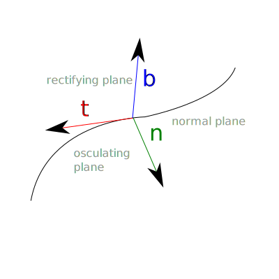

******
Curves
******

Types
=====

We can categorize the curves by various aspects.

* For instance, the dimension of the space where we describe the curve. The dimension number is usually an integer which is greater than 1. According to the dimension, we call them planar or spatial curve.
* Based on the length of the curve we can speak about finite length and infinite curves.
* In the case of finite length curves, we can categorize them as open and closed curves.
* The differentiability and periodicity also makes possible to classify them.
* We can also consider the self intersections of the curves.

.. note::

  The topic of fractal curves and space filling curves are a separate, but very interesting topic, where the previous, general statements not necessary holds.

Description methods
===================

In the case of planar curves, we have the following description methods:

* Explicit: :math:`y = f(x)`,
* Implicit: :math:`F(x, y) = 0`,
* Parametric: :math:`[x(t), y(t)]`,

where :math:`x, y, t \in \mathbb{R}`.

In the case of spatial curves, we cannot use the explicit form, therefore the followings have remained:

* Implicit: :math:`F(x, y, z) = 0`,
* Parametric: :math:`[x(t), y(t), z(t)]`,

where :math:`x, y, z, t \in \mathbb{R}`.

.. admonition:: Example

  .. :collapsible: closed

  Let describe the straight line, as a planar and as a spatial curve!

  In the case of planar curve:

  * We can use the form :math:`y = m \cdot x + b`, where :math:`m, b \in \mathbb{R}`.
  * In the implicit case :math:`F(x, y) = m \cdot x + b - y`.
  * For the parametric form, we have to know a :math:`(x_0, y_0)` point of the curve, and the direction :math:`(\Delta x, \Delta y)`, which results the points in the function of parameter :math:`t` as :math:`[x_0 + \Delta x \cdot t, y_0 + \Delta y \cdot t]`.

  In the case of spatial curve:

  * A straight line, which overlaps the axis :math:`x` can be described by an implicit form, as :math:`F(x, y, z) = y^2 + z^2`. (We can use arbitrary function instead of the square, which guarantee that, only in the case :math:`y = z = 0` will results that :math:`F(x, y, z) = 0`. For instance, the :math:`F(x, y, z) = |y| + |z|` is also an appropriate choice.) By rotating and translating the points in the space, we can described arbitrary straight lines in implicit form.
  * For the parametric form, we have to know a :math:`(x_0, y_0, z_0)` point of the curve, and the direction :math:`(\Delta x, \Delta y, \Delta z)`, which results the points in the function of parameter :math:`t` as :math:`[x_0 + \Delta x \cdot t, y_0 + \Delta y \cdot t, z_0 + \Delta z \cdot t]`.

  .. seealso::

    * https://en.wikipedia.org/wiki/Plane_curve

Some notes about the description methods:

* We can convert the explicit form to an implicit one easily by :math:`F(x, y) = f(x) - y`.
* In the implicit case, we can check that an arbitrary point belongs to the curve or not. However, the traversal of the points of the curve is problematic in general.
* The parametric curve has a practical significance, because it is appropriate for planar and spatial curves also.
* We can sure about that, the parametric form defines a curve (which may have some intersection point). It is not necessary in the case of implicit form, because the formalism is able to describe closed planar shapes and surfaces in the space.

Differential geometric definition
---------------------------------

We call the set of point :math:`\textbf{r}(t) = [x_1(t), \ldots, x_n(t)], t \in [a, b]` a curve, when the function :math:`\textbf{r}`

* continuous into the two directions,
* continuously differentiable by :math:`t`,
* :math:`\dot{\textbf{r}} \neq 0, \forall t \in [a, b]`.

.. seealso::

  * https://en.wikipedia.org/wiki/Curve
  * https://graphics.stanford.edu/courses/cs348a-09-fall/Handouts/miri_diff_curv.pdf

Parametric curves
=================

We can define a continuous function in arbitrary dimensional space as :math:`\mathbb{R} \rightarrow \mathbb{R}^n`, which is able to describe the points of a curve. We usually denote its parameter as :math:`t` or :math:`u`. (The notation :math:`t` refers to the *time*, because intuitively we can traverse the points of the curve at some speed.)

* The range of the parameter can be finite or infinite.
* It is possible to define the same curve in different parametric forms.

Arc length
----------

The length is one of the most natural property of the curve. We call it *arc length*. The length of a curve :math:`\textbf{r}(t), t \in [a, b]` between parameters :math:`a` and :math:`t` can be calculated a

.. math::

  s(t) = \int_{a}^{t} \! \lVert \dot{\textbf{r}}(t)\rVert \, \mathrm{d}t.

To see it, let divide the interval :math:`[a, b]` into :math:`n` equidistant parts. Let

.. math::

  \Delta t = \dfrac{b - a}{n},

which results the :math:`i`-th division point as :math:`t_i = a + i \Delta t`. At parameter :math:`t_i` the vector to the direction of :math:`t_{i+1}` is

.. math::

  \Delta \textbf{r}_i = \textbf{r}(t_{i+1}) - \textbf{r}(t_i),

where :math:`i = 0, 1, 2, \ldots, n`. The length of this vector is :math:`\lVert\Delta \textbf{r}_i\rVert`. Therefore, the length of the approximational segmented line is

.. math::

  s_n = \sum_{i=0}^{n-1} \lVert\Delta \textbf{r}_i\rVert =
        \sum_{i=0}^{n-1} \left\lVert \dfrac{\Delta \textbf{r}_i}{\Delta t} \right\rVert \Delta t.

By increasing the value of :math:`n`, this approximation will approach the arc length, in other words

.. math::

  \lim_{n\rightarrow\infty} s_n = s,

which results that

.. math::

  s(t) = \int_{a}^{t} \! \lVert \dot{\textbf{r}}(t)\rVert \, \mathrm{d}t.

.. admonition:: Example

  Let approximate the arc length of the curve :math:`y = \sin^2(x) + \cos(x)` (given in explicit form) above the interval :math:`x \in [1, 4]`!

  At first, let convert the curve to a parametric form:

    .. math::

        \textbf{r}(t) = \begin{bmatrix}
            t \\
            \sin^2(t) + \cos(t)
        \end{bmatrix}.

  The derivative of the curve by :math:`t` is

    .. math::

        \dot{\textbf{r}}(t) = \begin{bmatrix}
        1 \\
        2 \cdot \sin(t) \cdot \cos(t) - \sin(t)
        \end{bmatrix}.

  For calculating the arc length, we have to write the euclidean norm (in the assumption that the space is an euclidean space):

    .. math::

        s(t) =
        \int_{1}^{4} \! \lVert \dot{\textbf{r}}(t)\rVert \, \mathrm{d}t =
        \int_{1}^{4} \! \sqrt{1 + (2 \cdot \sin(t) \cdot \cos(t) - \sin(t))^2} \, \mathrm{d}t.

  We can approximate the value of the integral by numerical integration, for example by using the following JavaScript source code:

    .. code:: javascript

        function calc_integrand(t) {
            let s = Math.sin(t);
            let c = Math.cos(t);
            return Math.sqrt(1 + Math.pow(2 * s * c - s, 2));
        }

        const N = 100000;
        let s = 0.0;
        for (let i = 0; i < N; i++) {
            t = (i / N) * 3 + 1;
            s += calc_integrand(t);
        }
        s *= (3.0 / N);
        console.log(s);

  According to this calculation, the length of the curve is around 4.55.

    .. plot sin^2 x + cos x from 1 to 4
    .. int from 1 to 4 sqrt(1 + (2 sin(x) cos(x) - sin(x))^2) dx
    .. 4.55006291588

Frennet-Serret Frame
--------------------

In the case of spatial curves, we can speak about the Frennet-Serret Frame. It is a special coordinate system, which belongs to a point of the curve. We can determine it for any point of the curve, in the assumption that

* the curve is continuously differentiable at least 2 times, and
* :math:`\ddot{\textbf{r}}(u) \neq \textbf{0}, \forall u \in [a, b]`.

The unit vectors of this coordinate system

* the tangent: :math:`\textbf{t}(u) = \dfrac{\dot{\textbf{r}}(u)}{\lVert\dot{\textbf{r}}(u)\rVert}`,
* the binormal: :math:`\textbf{b}(u) = \dfrac{\dot{\textbf{r}}(u) \times \ddot{\textbf{r}}(u)}{\lVert\dot{\textbf{r}}(u) \times \ddot{\textbf{r}}(u)\rVert}` and
* the normal: :math:`\textbf{n}(u) = \textbf{b}(u) \times \textbf{t}(u)`,

which results a right hand Déscartes coordinate system.

The vectors of them defines three planes, namely

* :math:`(\textbf{b}(u), \textbf{n}(u))`: normal plane,
* :math:`(\textbf{t}(u), \textbf{n}(u))`: osculating plane, and
* :math:`(\textbf{t}(u), \textbf{b}(u))`: rectifying plane.

.. seealso::

  * https://en.wikipedia.org/wiki/Frenet%E2%80%93Serret_formulas

Tangent line
------------

A tangent line belongs to the points of the curve. Let consider it as a fixed :math:`\textbf{r}(t_0)` point at the parameter :math:`t_0`!

* The given point is necessarily belongs to the curve and the straight line. (It is possible to have more common points.)
* The direction of the straight line is the same as the direction of the tangent vector.
* The tangent line is independent from the length of the tangent vector, therefore we have a free parameter :math:`\lambda \in \mathbb{R}, \lambda \neq 0`.

The parametric form of the tangent line is:

.. math::

  \textbf{e}(t) = \textbf{r}(t_0) + t \cdot \lambda \dot{\textbf{r}}(t_0),

where :math:`\textbf{e}: \mathbb{R} \rightarrow \mathbb{R}^n`.

Curvature, osculating circle
----------------------------

In the consecutive points (except the special case of the straight line) the direction of the tangent vector is changing. The speed of this direction change (in other words, the deviation from the straight line) can be measured by the curvature.

Let consider a curve by using its natural (arc length) parametrization as :math:`\textbf{r}(s)`.

.. note::

  This kind of parametrization is necessary here, for describing the curve regardless of its further, possible parametrization which can affects the speed of the traversal.

Let choose parameters :math:`s` and :math:`s_0`. Let denote the angle of the tangent vectors at these points as :math:`\Delta \alpha`, moreover let :math:`\Delta s = |s - s_0|`! The curvature can be calculated at the point :math:`s_0` as

.. math::

  \kappa (s_0) = \lim_{s \rightarrow s_0} \dfrac{\Delta \alpha}{\Delta s}.

In the case of arc length parametrization the limit at the given point can be expressed as:

.. math::

  \kappa (s) = \lVert \textbf{r}''(s) \rVert.

For an arbitrary parametrization by :math:`t`:

.. math::

  \kappa (t) = \dfrac
  {\lVert \dot{\textbf{r}}(t) \times \ddot{\textbf{r}}(t) \rVert}
  {\lVert \dot{\textbf{r}}(t) \rVert^3}.

Some properties of the curvature:

* It is invariant to isometries of the curve.
* The curvature of the straight line is 0.
* Only the straight line and the circle has constant curvature.
* In the case of planar curves, we can consider signed curvature. The point, where the curvature change its sign is called inflexion point.

.. seealso::

  * https://en.wikipedia.org/wiki/Curvature

The osculating circle of the curve at the point :math:`t` has the following properties:

* Its plane is the osculating plane at the point :math:`t`.
* Its radius is :math:`\rho (t) = \dfrac{1}{\kappa (t)}`.
* Its center is :math:`\textbf{c}(t) = \textbf{r}(t) + \rho(t)\textbf{n}(t)`.

We consider it only when the curvature is not zero. (In the case of :math:`\kappa = 0`, it results an infinite radius circle, which is a straight line.)

Torsion
-------

When we analyzie a planar curve in the 3 dimensional space, its binormal vectors will be parallel. (In other words, their osculating planes will be the same.) We can consider a curve as a *real* spatial curve, when the direction of the binormal vectors will change in the consecutive points.

We can measure the deviation of the curve from the planar curve by the so called torsion.

Let assume that we have a curve with its natural parametrization: :math:`\textbf{r}(s)`! Let examine the curve at the parameters :math:`s` and :math:`s_0`! Let :math:`\Delta \beta` the angle of the binormals :math:`\textbf{b}(s)` and :math:`\textbf{b}(s_0)`, moreover :math:`\Delta s = |s - s_0|`!

We define the torsion at the :math:`s_0` point of the curve as:

.. math::

  \tau(s) = \lim_{s \rightarrow s_0} \dfrac{\Delta \beta}{\Delta s}.

In the case of natural parametrization, it also holds:

.. math::

  \tau(s) =
  \dfrac
  {\langle \textbf{r}'(s), \textbf{r}''(s), \textbf{r}'''(s) \rangle}
  {\kappa^2(s)}
  =
  \dfrac
  {\langle \textbf{r}'(s), \textbf{r}''(s), \textbf{r}'''(s) \rangle}
  {\lVert \textbf{r}''(s) \rVert^2}.

.. note::

  The notation :math:`\langle . \rangle` means the triple product of the vectors:

  * https://en.wikipedia.org/wiki/Triple_product

For an arbitrary parametrization by using :math:`t`:

.. math::

  \tau(t) =
  \dfrac
  {\langle \dot{\textbf{r}}(t), \ddot{\textbf{r}}(t), \textbf{r}(t) \rangle}
  {\lVert \dot{\textbf{r}}(t) \times \ddot{\textbf{r}}(t) \rVert^2}.

Properties:

* A curve is a planar curve if and only if its torsion is 0 for each points.
* There are only three curves which has constant torsion: the straight line, the circle and the helix.* The binormal vector is rotating around the tangent vector by the speed :math:`\tau(s)`.

.. seealso::

  * https://en.wikipedia.org/wiki/Torsion_of_a_curve
  * https://www2.math.upenn.edu/~wziller/math114f13/ch13-5+6.pdf

Questions
=========

* What are the commonly used description methods of the planar and spatial curves?
* What is the differential geometric definition of the curves?
* How can we define and calculate the arc length?
* What is the Frennet-Serret Frame and what are their vectors and planes?
* What is the definition of the tangent line?
* What is the definition of the curvature?
* What is the definition of the osculating circle?
* What is the definition of the torsion?

Exercises
=========

Half circle arc
---------------

Let describe a half circle arc!

* Let write its explicit, implicit and parametric form!
* Let visualize the arc!

Curve visualization
-------------------

Let examine the possible methods of curve visualization!

* How can we map the spatial curve to the plane?
* How can we plot the curve on a rasterized display?
* Let thinking about the visualization of straight line and circle!
* What kind of softwares are able to plot curves?

.. https://docs.octave.org/v4.2.0/Three_002dDimensional-Plots.html

Let plot the following curves!

.. math::

  \begin{align}
  f_1(x) &= x^3 + 2(x - 1)^2 \\
  f_2(x) &= x^7 - 4 x^5 + 3x^2 \\
  f_3(x) &= \sin(2x) + \cos(3x + 1) \\
  f_4(x) &= \sin(x) \cdot \cos(10x) \\
  f_5(x) &= \sin(e^x) \\
  f_6(x) &= \sin\left(\dfrac{1}{x + 1}\right) \\
  \end{align}

Let write their parametric forms!

Tangent line and normal vectors
-------------------------------

Calculate the

* tangent line and
* the normal vector

at an arbitrary point of the curves of the previous exercise!

Let draw the results!

Let write the parametric form of the tangent line!

Arc length
----------

Approximate the length of the curves (from the previous exercises) above an arbitrary choosen interval!

* Let write the definite integral of the calculation!
* Let check the result by using various kind of numerical integration and approximative segmented line!
* Let check, how the approximation changes in the function of divisions!

Let define a function (in your preferred programming language) which is able to provide an approximation directly from the parametric form of the curve!

Curvature and osculating circle
-------------------------------

Let calculate the curvature and the osculating circle at arbitrary chosen points of the previous curves!

Let plot the results!

Conical helix
-------------

Let write the parametric form of a conical helix, which

* is between the straight lines :math:`x = z, x = -z, y = z, y = -z`, and
* the coordinate :math:`z` of the curve point will increase by 1 after a full period of parameter :math:`t`.
Let accomplish the following tasks!

* Try to plot the curve!
* Let calculate the Frennet-Serret Frame of the curve at the parameter :math:`t = 10`!
* Let approximate the arc length on the interval :math:`t \in [8, 10]`! (Write the infinite integral and approximate numerically!)
* Let calculate the curvature, osculating circle and torsion at the parameter :math:`t = 10`!

Spatial curve
-------------

Let consider the following spatial curve:

.. math::

  \textbf{r}(t) = \begin{bmatrix}
  \cos(10 t) \cdot \sin(t) \\
  \sin(10 t) \cdot \sin(t) \\
  t \\
  \end{bmatrix}, t \in [0, \pi].

.. t = 0:0.01:pi;
.. x = cos(10*t).*sin(t);
.. y = sin(10*t).*sin(t);
.. z = t;
.. plot3(x, y, z);

* Let plot the curve!
* Let write the Frenet-Serret Frame at an arbitrary parameter of the curve!
* Draw its vectors on the plot of the curve!
* Let calculate the curvature, the osculating circle and the torsion!
* Let write the integral for calculating the arc length!
* Let approximate the length of the curve!
* Let assume that we use a parameter :math:`\lambda` instead of the constant 10! Let check the effect of different :math:`\lambda` values!
* Let describe the surface which contains any curve for any :math:`\lambda \in \mathbb{R}` parameters!

